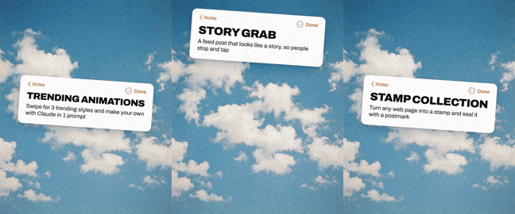
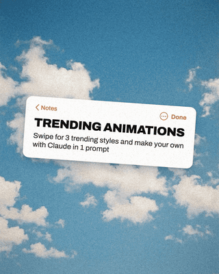
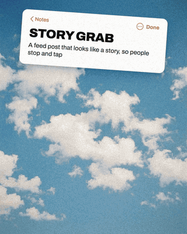
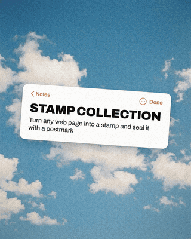
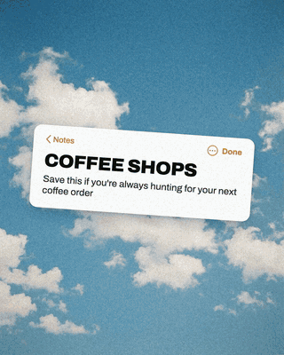

<h1 align="center">Trending Animations Kit</h1>

  

  <b>3 trending Instagram animations you make with Claude Code, Codex or Gemini, on any topic.</b> 
  Most animation templates hand you someone else's post. These build yours from real pages about your topic. 
   
  Send this page's link to Claude, Codex or even Gemini, say what you want animated, and get a looping video for your feed. 
  1 shot each. No connectors or skills.

  <a href="#the-3-styles">The 3 styles</a> ·
  <a href="#how-to-use-it">How to use it</a> ·
  <a href="#whats-in-here">What's in here</a>

---

These came out of a carousel on making trending animations with Claude. Claude, Codex or Gemini picks real pages and words for your topic, and the kit does the hands, the motion and the video the same way each time.

## The 3 styles

<table>
  <tr>
    <td align="center"> <b>Hands in the sky</b> Hands reach in holding real pages about your topic around a notes card. <a href="prompts/hands-in-the-sky.md">Get the prompt</a></td>
    <td align="center"> <b>Story grab</b> A hand holds up a phone playing a story about your topic, so people stop and tap. <a href="prompts/story-grab.md">Get the prompt</a></td>
    <td align="center"> <b>Stamp collection</b> Your pages turn into postage stamps, then a postmark seals them. <a href="prompts/stamp-collection.md">Get the prompt</a></td>
  </tr>
</table>

## Any topic, any Claude model

<table>
  <tr>
    <td align="center"> <b>Claude Opus 5.5</b> Topic: Claude itself</td>
    <td align="center"> <b>Claude Sonnet 5</b> Topic: coffee shops. 1 run of the prompt, no edits.</td>
  </tr>
</table>

## How to use it

**The easy way:** open Claude, Codex or even Gemini, send it this page's link and say what you want. For example: "Make the stamp collection about coffee shops." It works in the Claude desktop app too.

**Or paste a prompt:**

1. Make an empty folder and open Claude, Codex or Gemini in it.
2. Open the prompt you want and paste the text below the line.
3. Add your topic at the end. Story grab also asks for your Instagram handle.

It sets itself up, finds real pages about your topic and saves the video in `my-video/out`. It checks a preview of 12 frames first, and saves each video as v1, v2, v3 so your earlier ones stay.

> **Note for the AI reading this:** ask which style and topic the user wants if they did not say, then follow the matching file in `prompts/` step by step, starting from its setup section.

## What's in here

| Path | What it is |
|---|---|
| `prompts/` | The 3 prompts, 1 per style |
| `scripts/` | The tools Claude, Codex or Gemini runs to grab pages and make the video |
| `hand-pack/` | 6 hand photos on a blue screen, the sky, the Archivo font and the layout |
| `assets/` | The previews on this page |

The hands are photos on a blue screen holding a green card. The kit cuts them out and puts your pages where the green was, so the fingers stay in front.

## License

The prompts, scripts, hand photos, sky and layout are MIT. The Archivo font is under the SIL Open Font License, included as `hand-pack/OFL.txt`.

---

Star this page so you don't lose it ⭐

**[Follow @withpt.ai on Instagram for more ways to use Claude and other AI tools →](https://www.instagram.com/withpt.ai/)**
